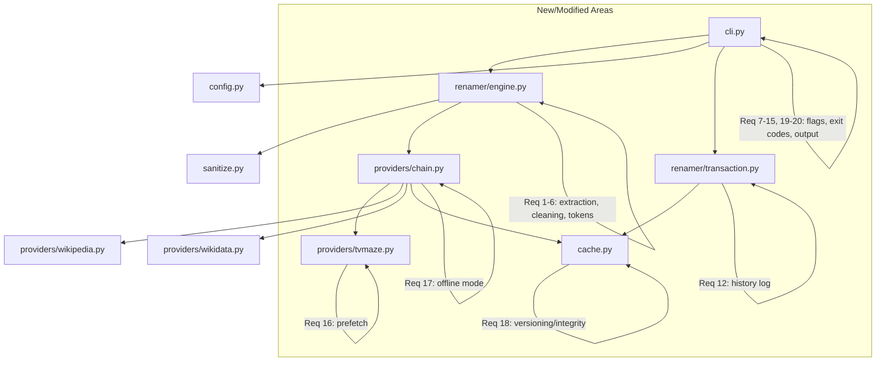

# Design Document: Design Gap Completion

## Overview

This design addresses the 20 requirements that fill the gaps between the existing tvrenamer design document and the actual codebase. The existing implementation provides: file scanning, regex pattern extraction, TVMaze/Wikipedia/Wikidata provider chain, disk cache with TTL/LRU, journaled atomic transactions, filename sanitization, multipart detection, subtitle pairing, structured logging, and an interactive CLI. The gap completion adds: path-aware extraction improvements (grandparent directory, blacklist), scene tag stripping, year extraction, title casing, short token aliases, exit codes, conflict reporting, colour-coded preview, junk cleanup, undo support, history logging, exclude patterns, fetch-titles control, verbose/quiet modes, prefetch seasons, offline mode, cache integrity/versioning, crash recovery prompts, and strict Windows mode activation.

## Architecture

The changes follow the existing layered architecture. No new top-level modules are introduced; instead, existing modules are extended:



### Key Design Decisions

1. **Keep changes in existing modules** — no new packages. Avoids import churn and keeps the flat structure.
2. **Engine remains the single planning authority** — all new extraction/cleaning logic lives in `engine.py` helper functions. The CLI only orchestrates.
3. **Provider chain gets an `offline` flag** — once the circuit breaker fires, the chain short-circuits to cache-only mode without modifying individual providers.
4. **Exit codes are resolved at CLI boundary** — the engine and providers raise typed exceptions; `cli.main()` catches and maps them to exit codes.
5. **History log is a post-commit hook on Transaction_Manager** — after journal state becomes "committed", a history file is written atomically.

## Components and Interfaces

### Engine Extensions (`tvrenamer/renamer/engine.py`)

New internal functions:

| Function | Signature | Purpose |
|----------|-----------|---------|
| `_is_season_dir(name)` | `str -> Optional[int]` | Returns season number if name matches season patterns, else None |
| `_resolve_show_name(filepath, root)` | `str, str -> str` | Walks ancestors applying blacklist, grandparent logic |
| `_strip_scene_tags(name, config)` | `str, dict -> str` | Removes scene tags and group patterns |
| `_extract_year(name)` | `str -> Tuple[str, Optional[int]]` | Splits year from name, returns (cleaned_name, year) |
| `_title_case(name)` | `str -> str` | Title-cases with short-word and acronym preservation |
| `_expand_template(template, tokens)` | `str, dict -> str` | Resolves both long and short aliases |
| `_classify_file(ext, junk_exts)` | `str, set -> str` | Returns "video", "subtitle", "junk", or "unknown" |
| `_matches_exclude(relpath, patterns)` | `str, List[str] -> bool` | Glob matching for exclude patterns |

Modified `plan_renames` gains parameters: `exclude_patterns`, `fetch_titles`, `strict_windows`, `junk_extensions`, `config`.

### CLI Extensions (`tvrenamer/cli.py`)

New CLI flags added to argparse:

- `--clean-junk`, `--trash-junk` (mutually exclusive group)
- `--undo <path>`
- `--exclude <pattern>` (append action, multiple allowed)
- `--fetch-titles` / `--no-fetch-titles` (mutually exclusive group)
- `--verbose` / `-v`, `--quiet` / `-q` (mutually exclusive group)
- `--strict-windows`
- `--no-color`

Exit code resolution logic:

```python
class ExitCode(IntEnum):
    SUCCESS = 0
    NO_MEDIA = 1
    API_ERROR = 2
    FILE_ERROR = 3
    INVALID_ARGS = 4
```

### Provider Chain Extensions (`tvrenamer/providers/chain.py`)

```python
class ProviderChain(MetadataProvider):
    def __init__(self, providers, cache=None):
        self.providers = providers
        self.cache = cache
        self._offline = False

    def enter_offline_mode(self):
        self._offline = True

    def get_episode_title(self, show_name, season, episode):
        if self._offline:
            return self._cache_only_lookup(show_name, season, episode)
        # ... existing chain logic with circuit-breaker callback
```

### TVMaze Prefetch (`tvrenamer/providers/tvmaze.py`)

New method `_prefetch_season(show_id, season)` fetches all episodes for a season and populates cache entries using existing key format. Called on first episode access for a show+season when config flag is set.

### Cache Integrity (`tvrenamer/cache.py`)

New constants and logic:

```python
CACHE_VERSION = 1
META_KEY = "_meta"

# On load: check version, compute/verify checksum
# On persist: compute checksum over sorted data, write _meta entry
```

### Transaction History (`tvrenamer/renamer/transaction.py`)

New function:

```python
def write_history_file(journal: Journal, target_dir: str) -> Optional[str]:
    """Write renamed_history_YYYYMMDD_HHMMSS.json after successful commit."""
```

### Colour Output Helper (inline in `cli.py`)

```python
def _should_color() -> bool:
    return sys.stdout.isatty() and not os.environ.get("NO_COLOR") and not args.no_color

def _dim(text): return f"\033[2m{text}\033[0m" if _should_color() else text
def _green(text): return f"\033[32m{text}\033[0m" if _should_color() else text
```

## Data Models

### Expanded Plan Entry (internal dict, not persisted)

```python
@dataclass
class PlanEntry:
    src: str
    dst: str
    conflict: bool = False           # Req 8
    intended_dst: Optional[str] = None  # original dst before counter suffix
    category: str = "video"          # "video" | "subtitle" | "junk"
```

### History File Schema (Req 12)

```json
{
  "timestamp": "2025-01-15T10:30:00+01:00",
  "run_id": "a1b2c3d4...",
  "renamed_files": [
    {"original": "/abs/path/old.mkv", "new": "/abs/path/new.mkv"}
  ]
}
```

### Cache Meta Entry (Req 18)

```json
{
  "_meta": {
    "version": 1,
    "checksum": "sha256hexdigest..."
  },
  "tvmaze:show:the+rookie": {"value": {...}, "ts": 1700000000, "atime": 1700000000}
}
```

### Config Extensions

New config sections consumed by `load_config`:

```toml
[path_extraction]
directory_blacklist = ["Downloads", "TV Shows", "TV", "Completed", "Desktop", "Videos", "Media", "Series", "Shows"]

[scene_tags]
strip = ["PROPER", "REPACK", ...]
group_tag_patterns = ["\\[.*?\\]", "-\\w+$"]

[junk]
extensions = [".nfo", ".txt", ".url", ".jpg", ".jpeg", ".png", ".bmp", ".tbn"]

[defaults]
fetch_titles = true
strict_windows = false
exclude_patterns = []
space_replacement = ""

[provider.tvmaze]
prefetch_seasons = false
```


## Correctness Properties

*A property is a characteristic or behavior that should hold true across all valid executions of a system — essentially, a formal statement about what the system should do. Properties serve as the bridge between human-readable specifications and machine-verifiable correctness guarantees.*

### Property 1: Show Name Resolution from Ancestors

*For any* file path where the parent directory matches a season pattern (e.g., "Season 1", "S01"), the resolved show name SHALL equal the cleaned grandparent directory name, unless the grandparent is blacklisted or missing — in which case the show name falls back to filename extraction or "Unknown". Conversely, for any file path where the parent does NOT match a season pattern, the resolved show name SHALL come from the (cleaned) parent directory (unless it is blacklisted).

**Validates: Requirements 1.1, 1.2, 1.3, 1.4, 1.5, 2.4, 2.5**

### Property 2: Blacklist Merge is a Superset

*For any* user-provided blacklist and the default blacklist, the effective blacklist used by the engine SHALL be a superset of both — every entry from the default list and every entry from the user list appears in the merged result, and matching is case-insensitive.

**Validates: Requirements 2.2, 2.4**

### Property 3: Scene Tag and Group Tag Removal

*For any* filename and any subset of configured scene tags injected into that filename (bounded by whitespace/separators), after cleaning, the output SHALL contain none of the injected tags (case-insensitive). Similarly, for any group tag pattern match appended to a filename, the cleaned output SHALL not contain the matched group tag portion. Cleaning order is preserved: separator normalization → scene tag removal → group tag removal → title casing.

**Validates: Requirements 3.2, 3.4, 3.7**

### Property 4: Year Extraction Positioning

*For any* filename containing a four-digit number in 1950–2099 positioned before any SxxExx or season/episode marker, the engine SHALL extract that number as the year. *For any* filename where such a number appears only after a season/episode marker, the engine SHALL NOT extract it as the year.

**Validates: Requirements 4.1, 4.2**

### Property 5: Title Casing Rules

*For any* cleaned show name string, the title casing function SHALL produce output where: (a) the first word is always capitalized, (b) words in the short-word list ("a", "an", "the", "and", "but", "or", "nor", "for", "yet", "so", "in", "on", "at", "to", "by", "of", "up", "is") are lowercase when not the first word, (c) all-uppercase words of 2–5 characters are preserved unchanged, and (d) all other words have their first letter capitalized.

**Validates: Requirements 5.1, 5.2, 5.3, 5.4**

### Property 6: Short Token Aliases Equivalence

*For any* metadata values (show, season, episode, title, year) and any template string, replacing `{s}` with `{season}`, `{e}` with `{episode}`, `{t}` with `{title}`, and `{y}` with `{year}` SHALL produce an identical output filename. That is, the short and long forms are interchangeable.

**Validates: Requirements 6.1, 6.2, 6.3, 6.4, 6.5, 6.6, 6.7**

### Property 7: File Classification Determinism and Correctness

*For any* file extension, the classification function SHALL assign exactly one category (video, subtitle, junk, or unknown), and the assigned category SHALL match the configured extension sets — video extensions match VIDEO_EXTS, subtitle extensions match subtitle set, junk extensions match the configured junk list, and all others are "unknown".

**Validates: Requirements 10.4**

### Property 8: Exclude Patterns Filter Completeness

*For any* file whose path relative to the scan root matches at least one exclude glob pattern (from CLI or config), that file SHALL NOT appear in the rename plan. Conversely, files that match no exclude pattern SHALL be included (assuming they pass extension classification).

**Validates: Requirements 13.3, 13.5**

### Property 9: Rename-Undo Round Trip

*For any* successful rename transaction that produces a history file, parsing that history file and executing the undo operation SHALL produce a plan that maps each `new` path back to its `original` path — i.e., the history format is a faithful invertible record of the rename operation.

**Validates: Requirements 11.3, 12.4**

### Property 10: Cache Integrity Round Trip

*For any* cache state (set of namespace:key entries with values), persisting to disk and reloading SHALL produce an identical data set, verified by the SHA-256 checksum. If the checksum does not match on load, the cache is discarded (empty state).

**Validates: Requirements 18.1, 18.2, 18.3, 18.4**

## Error Handling

| Scenario | Handling | Exit Code |
|----------|----------|-----------|
| No media files found | Log info, exit early | 1 |
| API/provider failure (partial) | Continue with empty title, log warning; if circuit breaker trips → offline mode | 2 |
| File operation error (permission, disk full) | Rollback transaction, log error | 3 |
| Invalid args / bad config / invalid exclude pattern | Print error to stderr, exit before scanning | 4 |
| Multiple error types in one run | Return lowest non-zero exit code (highest priority) | min(codes) |
| Corrupt cache file | Rotate to `.corrupt.{epoch}`, start fresh | N/A (warning) |
| History file write failure post-commit | Log error, do NOT rollback committed renames | N/A (warning) |
| Junk file delete/move failure | Log warning, continue processing remaining files | N/A (warning) |
| Undo source missing | Log warning, skip entry, continue | N/A (warning) |
| Pending journals on startup (interactive) | Prompt: resume/rollback/ignore | N/A |
| Pending journals on startup (non-interactive) | Log warning, suggest --resume/--rollback, proceed | N/A |

### Exception Types (internal)

```python
class TVRenamerError(Exception): pass
class NoMediaFoundError(TVRenamerError): pass      # → exit 1
class ProviderError(TVRenamerError): pass          # → exit 2  
class FileOperationError(TVRenamerError): pass     # → exit 3
class InvalidConfigError(TVRenamerError): pass     # → exit 4
```

## Testing Strategy

### Property-Based Tests (using `hypothesis`)

The project uses `pytest` with the `hypothesis` library for property-based testing. Each property test runs a minimum of 100 iterations.

| Property | Test File | What's Generated |
|----------|-----------|-----------------|
| P1: Show name resolution | `tests/test_show_resolution_props.py` | Random directory structures (depth 1–5), season patterns, blacklisted names |
| P2: Blacklist merge | `tests/test_blacklist_props.py` | Random user blacklist strings |
| P3: Scene tag removal | `tests/test_scene_tag_props.py` | Random filenames with injected scene tags and group patterns |
| P4: Year extraction | `tests/test_year_extraction_props.py` | Filenames with years in various positions relative to SxxExx markers |
| P5: Title casing | `tests/test_title_case_props.py` | Random multi-word strings with mixed case, acronyms, short words |
| P6: Token aliases | `tests/test_template_props.py` | Random metadata dicts and templates with mixed short/long tokens |
| P7: File classification | `tests/test_classification_props.py` | Random file extensions from known sets + random unknown extensions |
| P8: Exclude patterns | `tests/test_exclude_props.py` | Random file paths and glob patterns |
| P9: Rename-undo round trip | `tests/test_undo_roundtrip_props.py` | Random rename plans (src→dst pairs) |
| P10: Cache integrity | `tests/test_cache_integrity_props.py` | Random cache dictionaries with varied keys/values |

**Tag format**: Each test is tagged with a comment: `# Feature: design-gap-completion, Property N: <title>`

### Unit Tests (example-based)

- Exit code scenarios (Req 7) — mock errors, verify codes
- Colour output with mock TTY (Req 9)
- Junk cleanup integration (Req 10) — create temp dirs, verify delete/trash
- Undo with missing files, conflicts (Req 11)
- Verbose/quiet output capture (Req 15)
- Prefetch seasons mock (Req 16)
- Offline mode activation (Req 17)
- Crash recovery prompts with mock stdin (Req 19)
- Strict Windows flag passthrough (Req 20)
- Config parsing for all new sections (Req 2, 3, 13, 14, 16)

### Integration Tests

- End-to-end CLI run with temp directory trees
- Undo round-trip on real filesystem
- Conflict counter suffix generation
- Journal crash recovery (simulate interrupt)

### Test Configuration

```ini
# pytest.ini (already exists)
[pytest]
minversion = 6.0
testpaths = tests
```

Dependencies to add:
```
hypothesis>=6.0
```

Property test settings (in conftest.py or per-test):
```python
from hypothesis import settings
settings.register_profile("ci", max_examples=200)
settings.register_profile("default", max_examples=100)
```
